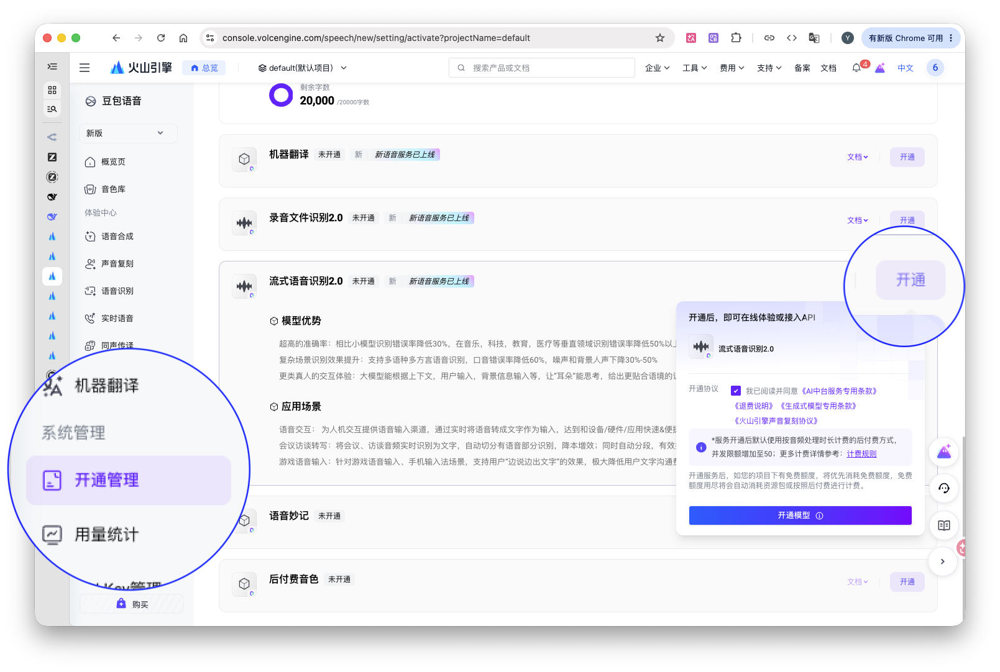
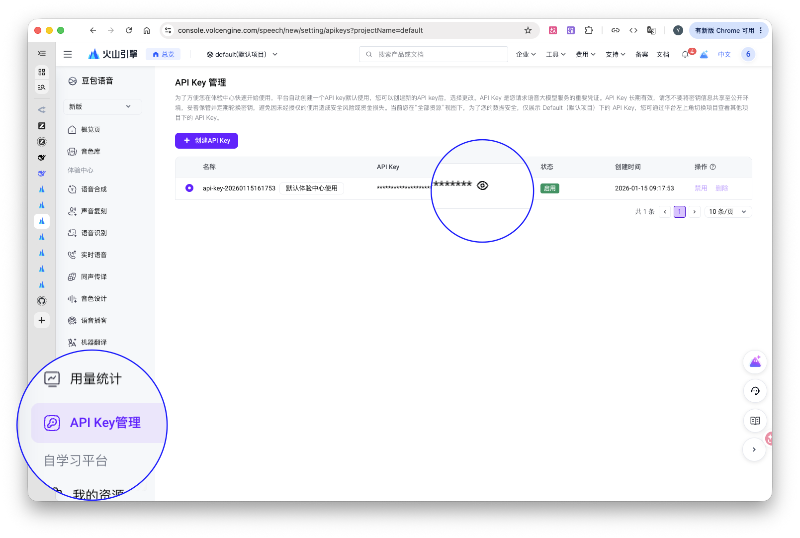
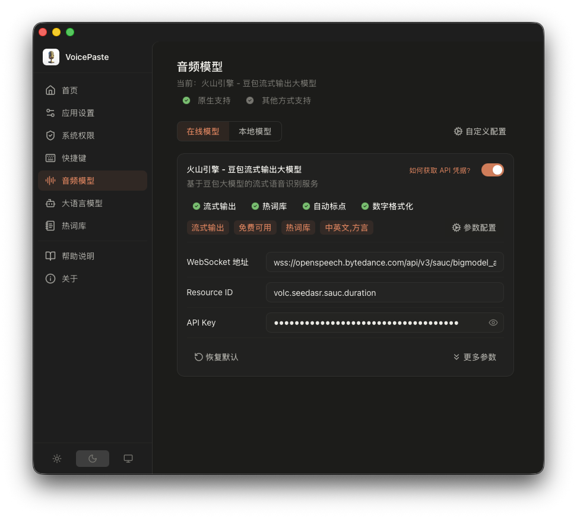
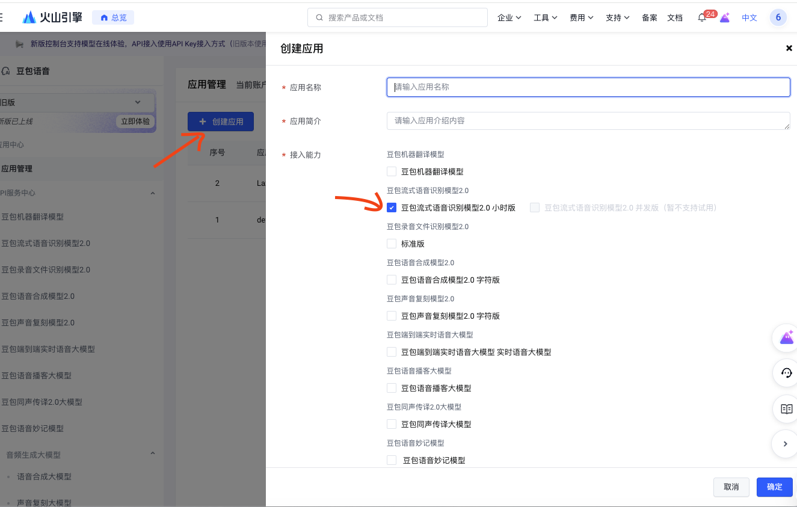
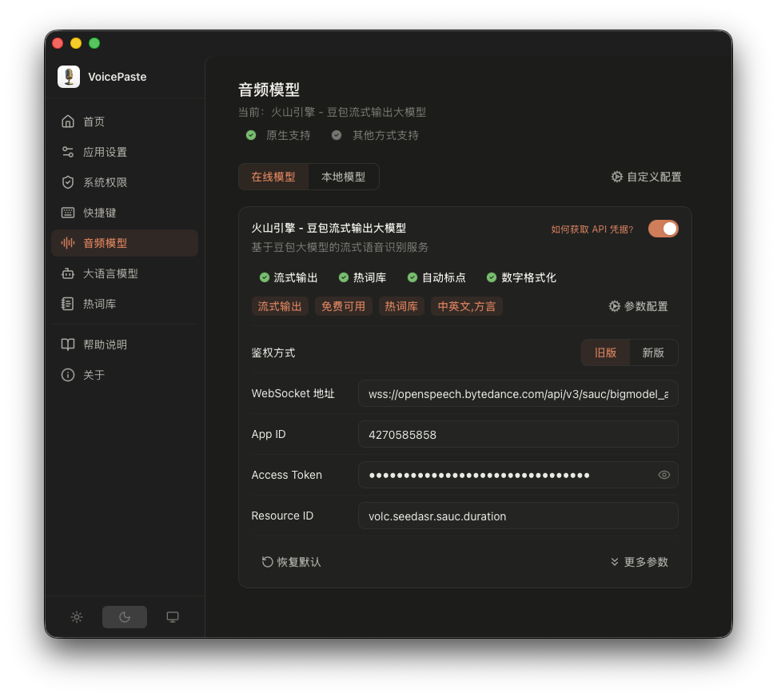

# Voice Paste 配置说明

## 快速开始（最小配置）

- 设置 > 系统权限，开启麦克风授权与辅助功能授权（仅 macOS 需要）
- 设置 > 音频模型，配置一个 ASR 模型：在线模型需填写 API Key，本地模型需下载并启用
- 设置 > 快捷键，配置自定义快捷键

## 系统权限

- 首次启用语音输入时，系统会请求麦克风权限
- macOS 需要额外手动添加辅助功能权限以允许语音输入后自动粘贴。可通过 设置 > 系统权限 > 辅助功能 > 前往授权 将 VoicePaste 加入允许列表；或直接从 系统设置 > 隐私与安全性 > 辅助功能 添加。

## ASR 模型选择

- 设置 > 音频模型，选择在线模型（参考[火山引擎](#火山引擎)）或本地模型（参考[本地模型](#本地模型)）

## 快捷键配置

- 设置 > 快捷键，设置自定义快捷键
- 支持两种触发模式：
  - **点击切换（Toggle）**：按一次快捷键开始，再按一次结束，中途可按 `ESC` 取消
  - **按住说话（Hold）**：按住快捷键开始，松开结束
- 支持为不同的文本润色模板绑定独立快捷键

## 文本润色配置

- 前往 设置 > 大语言模型，选择并启用一个 LLM 提供商（同时仅一个生效）
- 在 文本润色 中添加需要的润色模板，可添加多个
- 前往 设置 > 快捷键，为每个模板绑定对应的快捷键

## 热词配置

- 设置 > 热词库 中管理热词
- 支持多个热词表，同时仅一个生效，可手动切换
- 支持批量添加热词，通过 `,` 逗号分隔，输入 `↩︎` 确认
- 热词支持权重参数，格式为 `热词|权重值`，权重范围 1–10，不填默认为 4
- 热词开启后，对原生支持热词的模型自动生效：豆包流式输出模型、Zipformer、FunASR-Nano、Qwen3-ASR
- **热词强化**：支持三种模式
  - **自动**：模型支持热词则仅用模型能力；不支持时若启用了文本润色，则将热词追加到润色提示词中；否则不使用
  - **关闭**：完全不使用本地热词
  - **开启**：同时向模型和文本润色追加热词，最大化识别准确率
- **热词替换**：识别完成后，将结果中的热词还原为原始格式（如恢复标点符号、大小写等）。模型内置热词通常不支持标点，部分模型英文热词仅支持大写——启用此功能可自动还原热词原貌。

## 其他配置

- **提示音**：应用设置 > 提示音，可启用/关闭语音输入的开始和结束提示音，支持替换为本地音频文件
- **移除末尾句号**：应用设置 > 移除末尾句号，启用后自动删除识别结果末尾的句号
- **保留剪切板**：应用设置 > 保留剪切板，启用后不直接粘贴到输入框，而是将结果保留在剪切板中手动粘贴
- **体验 Beta 版本**：开启后接收 Beta 版本更新提醒，可升级到 Beta 测试版；后续 Stable 版发布后可继续升级（Beta 版本为测试版本，可能不稳定）

## 模型配置

### 火山引擎

#### API获取

**新版本**
- 登录 [火山引擎控制台 > 豆包语音 > 开通管理](https://console.volcengine.com/speech/new/setting/activate) 找到 流式语音识别2.0 并选择开通，新项目有赠送额度 20 小时，具体请参考官方说明，注意用量。

- 前往 [火山引擎控制台 > API Key 管理](https://console.volcengine.com/speech/new/setting/apikeys)，获取 或 创建一个 API key

- 在配置页面填入凭证，点击保存即可

**老版本**
- 登录[火山引擎控制台](https://console.volcengine.com/speech/app)，创建一个应用，选择"豆包流式语音识别模型2.0 小时版"

- 进入对应模型，选择创建的 app，并开通模型包，下方可以看到 APP ID， Access Token

- 在配置页面填入凭证，点击保存即可

#### 热词表

该模型支持在线热词表与本地热词表。

- 在线热词表：前往 [火山引擎控制台 > 豆包语音 > 热词管理](https://console.volcengine.com/speech/new/hot-word) 中配置，配置完成后拷贝热词表 ID，填入 设置 > 音频模型 > 火山引擎 > 参数配置 > 更多参数 > 热词表 ID。详细说明可参考[火山引擎热词配置文档](https://www.volcengine.com/docs/6561/155739)。
- 本地热词表：参考[热词配置](#热词配置)章节。

在线热词表与本地热词表同时存在时，优先级：本地 > 在线。可配合 LLM 文本润色使用以强化识别效果，参考[文本润色配置](#文本润色配置)。

#### 替换词表
替换词仅支持通过在线配置。前往 [火山引擎控制台 > 豆包语音 > 替换词](https://console.volcengine.com/speech/new/correct-word) 添加替换词表，完成后拷贝替换词表 ID，填入 设置 > 音频模型 > 在线模型 > 火山引擎 > 参数配置 > 更多参数 > 替换表 ID。
  
详细说明可参考 [火山引擎替换词文档](https://www.volcengine.com/docs/6561/1206007)

#### 其他自定义参数微调
可参考[火山引擎大模型流式语音识别API文档](https://www.volcengine.com/docs/6561/1354869)

### 本地模型

VoicePaste 本地模型基于 sherpa-onnx 接入，默认搭配 VAD 模型使用，可选配 Punctuation 模型做识别后处理（追加标点符号）。

#### 模型下载

设置 > 音频模型 > 本地模型，选择需要的模型并下载（会自动下载适配的 VAD 和 Punctuation 模型），下载完成后直接启用即可。

#### 参数配置

各模型均开放全部参数供个性化调整，默认参数即可正常使用。详细配置及模型说明可参考 [sherpa-onnx 官方指南](https://k2-fsa.github.io/sherpa/onnx/index.html)。

#### 自定义配置

设置 > 音频模型 > 自定义配置 > 离线模型推理，提供离线模型的统一参数，对所有 sherpa-onnx 模型生效。
