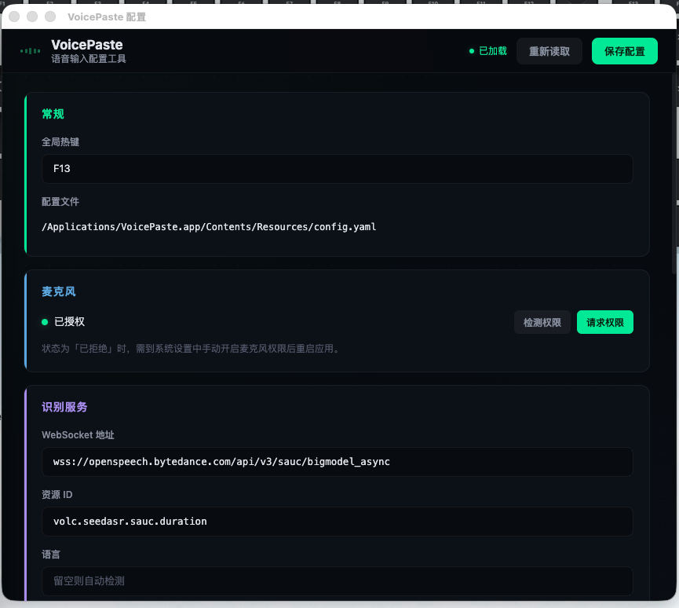
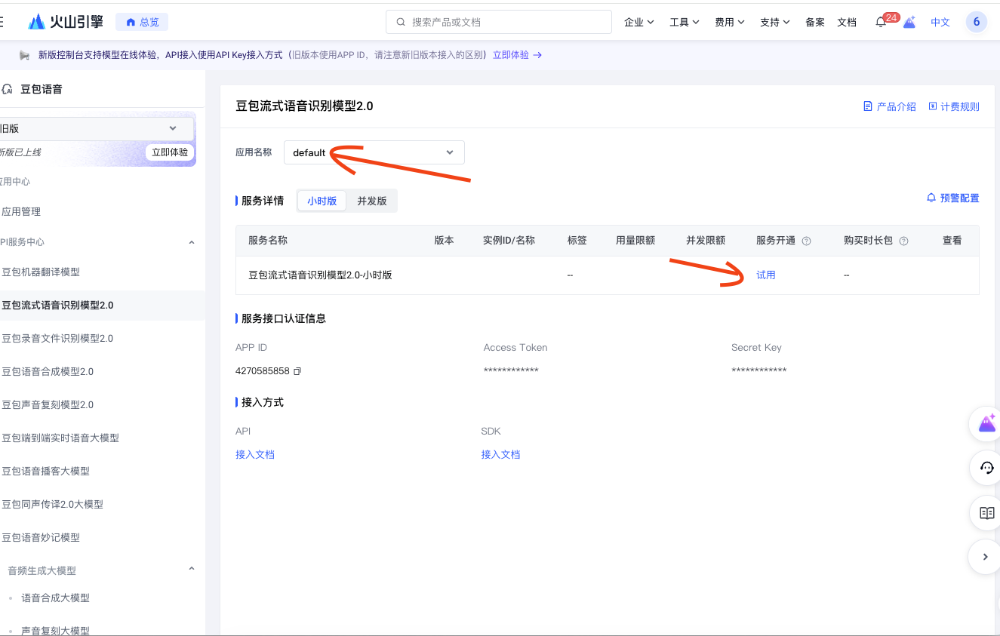
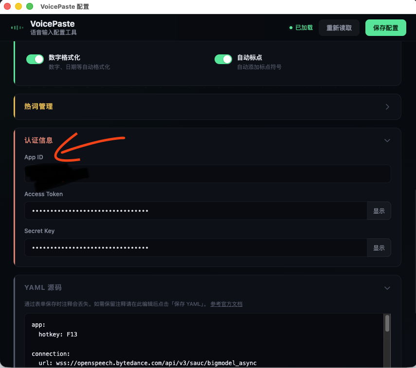

# VoicePaste

> A voice input tool for macOS & Windows — press a hotkey, speak, auto-paste.

**[中文](README.zh.md)**

## Features

- **Global Hotkey** — Default F13, customizable in `config.yaml`
- **Real-time ASR** — ByteDance Doubao streaming ASR via WebSocket
- **Auto Paste** — Automatically pastes recognized text into the focused input field
- **Floating Overlay** — Transparent overlay window showing real-time transcription
- **Hotwords** — Custom hotwords to improve recognition accuracy for domain-specific terms
- **System Tray** — Runs in the background, no Dock icon

## Preview

**Voice Input**


**Settings Page**



---

## Getting API Credentials

- Log in to the [Volcengine Console](https://console.volcengine.com/speech/app), create an app, and select "Doubao Streaming ASR Model 2.0 (Hourly)"


- Open the model, select your app, and enable the model package. You'll see the APP ID, Access Token, and Secret Key below



- Enter the credentials in the settings page and click Save



## Installation

### Build from Source

```bash
git clone https://github.com/that-yolanda/voicepaste.git
cd voicepaste
pnpm install
pnpm start
```

### Package

```bash
pnpm pack
```

Output is in the `dist/` directory.

## Configuration

Edit `config.yaml` in the project root and fill in your credentials:

| Field | Description |
|-------|-------------|
| `app.hotkey` | Global hotkey, default `F13` |
| `connection.app_id` | Volcengine App ID |
| `connection.access_token` | Volcengine Access Token |
| `connection.secret_key` | Volcengine Secret Key |
| `connection.resource_id` | ASR Resource ID |
| `request.context_hotwords` | Custom hotwords list |

Get your credentials from [Volcengine Voice Service](https://www.volcengine.com/product/voice-service).

## FAQ

### VoicePaste doesn't work on macOS?

VoicePaste requires **Microphone** and **Accessibility** permissions to function properly.

**Microphone Permission**

1. Settings page → System Permissions → Click "Request Permission"
2. System Settings → Privacy & Security → Microphone, make sure VoicePaste is authorized
3. If previously denied, reset via Terminal and re-authorize:
```bash
tccutil reset Microphone com.yolanda.voicepaste
```

**Accessibility Permission**

1. System Settings → Privacy & Security → Accessibility, make sure VoicePaste is authorized
2. If reinstalled after deletion, you need to add it again

### Hotwords work during streaming but are wrong in the final result with non-stream enabled?

The non-stream (second-pass) recognition mode does not currently support hotword libraries or injected hotwords — only correction tables are supported. Create a [correction table](https://console.volcengine.com/speech/correctword) in the Volcengine console and replace `boosting_table_id` with `correct_table_id` in your config.

## Project Structure

```
voicepaste/
├── main/               # Electron main process
│   ├── main.js         # App entry, state machine & hotkey management
│   ├── asrService.js   # WebSocket ASR client (binary protocol)
│   ├── pasteService.js # Clipboard write + AppleScript paste
│   ├── windowManager.js# Window creation & management
│   ├── config.js       # Config loading & hot-reload
│   └── logger.js       # Logging module
├── preload/            # Preload scripts
│   └── preload.js      # contextBridge API
├── renderer/           # Renderer process
│   ├── index.html      # Floating overlay window
│   ├── app.js          # Audio capture & text display
│   ├── settings.html   # Settings page
│   ├── settings.js     # Config editor
│   └── settings.css    # Settings page styles
├── build/              # Build assets (icons, etc.)
├── config.yaml         # Configuration file (fill in credentials)
└── package.json
```

## Tech Stack

- **Electron** — Desktop app framework
- **ByteDance Doubao ASR** — Streaming speech recognition (WebSocket + binary protocol)
- **gzip** — Custom binary framing (4-byte header + compressed JSON)
- **AppleScript / PowerShell** — Simulates Cmd+V / Ctrl+V paste

## How It Works

```
Press hotkey → Start recording → Mic captures PCM audio → Downsample to 16kHz
  → IPC audio chunks → WebSocket to ASR service
  → Stream back results → Overlay displays text
Press again → Wait for final result → Copy to clipboard → AppleScript Cmd+V paste
```

## System Requirements

- macOS 12+ / Windows 10+
- Node.js 18+
- pnpm

## Development

```bash
# Run in development mode
pnpm dev

# Package macOS app
pnpm pack

# Package Windows installer
pnpm pack:win
```

## License

[MIT](LICENSE)

---

## Changelog

### v1.1.0 (2025-04)

- **UI Redesign** — New Claude-inspired interface with warm minimalism color palette
- **Overlay Optimization** — Eliminated text flickering during speech, smooth horizontal expansion animation
- **Cross-platform Fonts** — Unified sans-serif font stack for macOS / Windows
- **External Links** — Settings page links now open in the system default browser
- **Settings Page** — Added GitHub repo link, unified terra cotta section theme
- **FAQ** — Added common questions (macOS permissions, non-stream hotwords, Windows compatibility)

### v1.0.0 (2025-03)

- Initial release
- Global hotkey voice input
- ByteDance Doubao streaming ASR
- Auto-paste into the focused input field
- Floating overlay with real-time transcription
- Hotword support
