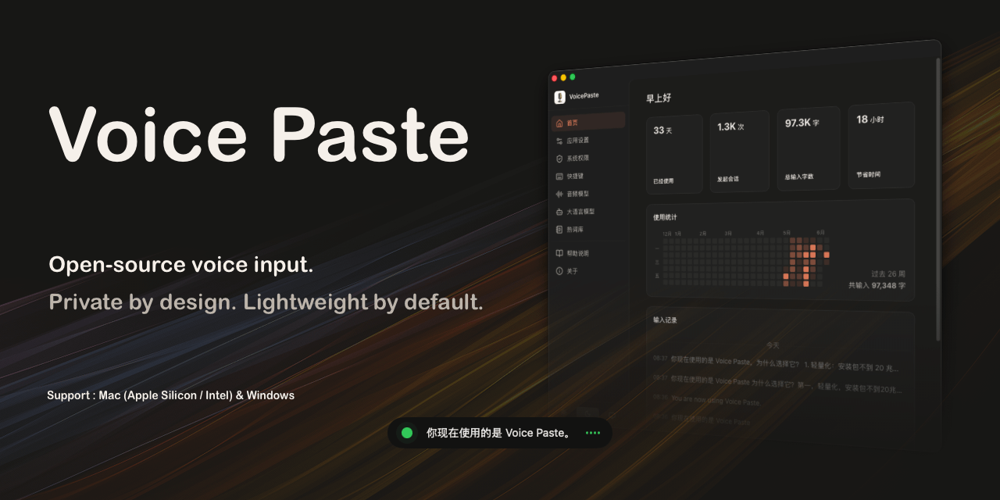
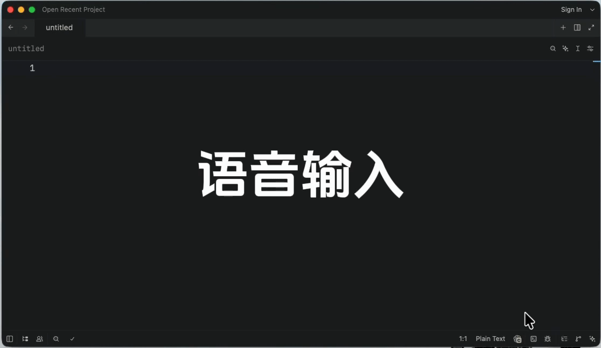

<div align="center">



# VoicePaste

macOS & Windows 语音输入工具 — 通过快捷键触发语音输入并自动粘贴。

[](https://github.com/that-yolanda/voicepaste/releases/latest)
[](https://github.com/that-yolanda/voicepaste/releases/latest)
[](https://github.com/that-yolanda/voicepaste/blob/master/LICENSE)
[](https://ko-fi.com/thatyolanda)

**[中文](README.zh.md)** | **[English](README.md)**

</div>

## 效果演示



## 功能特性

- **轻量化**：安装包约 20 MB；macOS 打包版空闲状态约 120 MB。在线识别峰值约 150 MB；本地模型按需加载，峰值内存视模型和推理后端而定。
- **数据安全**：数据完全本地存储，不上传至任何第三方服务器；API 密钥由用户自行申请，完全自主可控。
- **参数完全自定义**：开箱即用的默认配置，同时开放全部参数供用户按需调整。
- **ASR 在线 / 本地双引擎**：在线引擎 — 火山引擎豆包流式语音识别；本地引擎 — 基于 sherpa-onnx，支持 CPU / CUDA / CoreML 加速，内存占用视模型和推理后端而定。
- **LLM 支持**：内置 8 种 LLM 提供商 — DeepSeek、OpenAI、Anthropic、Gemini、OpenRouter、SiliconFlow、Ollama 及 OpenAI 兼容接口。
- **流式输出**：对不支持原生流式输出的本地模型，通过 VAD 分段配合模拟流式输出，让识别结果实时呈现，减少等待感。
- **多场景文本润色**：内置通用整理、翻译、邮件撰写等场景模板，支持自定义提示词（Prompt），可为不同模板绑定独立快捷键。
- **热词库**：支持多组热词库，强化领域专有名词识别准确率；自动还原热词原始格式（大小写、特殊符号等），避免手动修正。
- **跨平台**：macOS（Apple Silicon / Intel）与 Windows。
- **自定义快捷键**：为不同场景（通用、翻译、文本格式化等）绑定独立快捷键，支持 `toggle`（按一次开始、再按一次结束）和 `hold`（按住说话、松开结束）两种触发方式。
- **体验升级**：操作提示音、实时音频波形动画。
- **Apple 官方签名与公证**：macOS 安装包经过 Apple Developer 签名及公证，安装时不会触发 Gatekeeper 安全警告（Windows 版本暂未签名）。

## 快速开始

### 下载地址

前往 [GitHub Releases](https://github.com/that-yolanda/voicepaste/releases/latest) 下载对应平台的最新版本。

| 平台                  | 安装包文件名                          |
| --------------------- | ------------------------------------- |
| macOS（Apple Silicon） | `VoicePaste_{version}_aarch64.dmg`           |
| macOS（Intel）         | `VoicePaste_{version}_x64.dmg`               |
| Windows（x64）         | `VoicePaste_{version}_x64-setup.exe` / `.msi` |

### 配置说明

| 类型                 | 地址                                                                   |
| -------------------- | ---------------------------------------------------------------------- |
| 通用配置说明         | [EN](GUIDANCE.md#quick-start) / [中文](GUIDANCE.zh.md#快速开始)   |
| 豆包流式语音识别模型 | [EN](GUIDANCE.md#volcengine) / [中文](GUIDANCE.zh.md#火山引擎)           |
| 本地模型             | [EN](GUIDANCE.md#local-models) / [中文](GUIDANCE.zh.md#本地模型) |

## 模型接入与能力清单

### ASR 模型

| 类型     | 模型                    | 配置说明                                                               | 模型文件大小 | 峰值内存（macOS 活动监视器） | 支持语言                        | 流式输出        | 热词库           | 标点还原 (Punctuation) | 口语转书面 (ITN) | 模型 ID                                                    |
| -------- | ----------------------- | ---------------------------------------------------------------------- | ------------ | -------- | ------------------------------- | --------------- | ---------------- | ---------------------- | ---------------- | ---------------------------------------------------------- |
| 在线模型 | 豆包流式语音识别模型2.0 | [EN](GUIDANCE.md#volcengine) / [中文](GUIDANCE.zh.md#火山引擎)           | -            | ~150 MB  | 中英混说，方言                  | ✅️              | ✅️               | ✅️                     | ✅️               | -                                                          |
| 本地模型 | SenseVoice              | [EN](GUIDANCE.md#local-models) / [中文](GUIDANCE.zh.md#本地模型) | 158 MB       | ~580 MB  | 中英日韩粤                      | ☑️ 模拟流式输出 | ☑️ 配合 LLM 支持 | ☑️ 配合标点模型实现    | ☑️ 配合 LLM 实现 | sherpa-onnx-sense-voice-zh-en-ja-ko-yue-int8-2025-09-09    |
| 本地模型 | Zipformer 中英双语      | [EN](GUIDANCE.md#local-models) / [中文](GUIDANCE.zh.md#本地模型) | 150 MB       | ~465 MB  | 中英双语                        | ✅️              | ✅️               | ☑️ 配合标点模型实现    | ☑️ 配合 LLM 实现 | sherpa-onnx-streaming-zipformer-bilingual-zh-en-2023-02-20 |
| 本地模型 | FunASR-Nano             | [EN](GUIDANCE.md#local-models) / [中文](GUIDANCE.zh.md#本地模型) | 948 MB       | ~2.5 GB  | 中英，7种方言                   | ☑️ 模拟流式输出 | ✅️               | ✅️                     | ✅️               | sherpa-onnx-funasr-nano-int8-2025-12-30                    |
| 本地模型 | Qwen3-ASR-0.6B          | [EN](GUIDANCE.md#local-models) / [中文](GUIDANCE.zh.md#本地模型) | 938 MB       | 待测     | 30 种语言，中文方言，歌词，说唱 | ☑️ 模拟流式输出 | ✅️               | ✅️                     | ✅️               | sherpa-onnx-qwen3-asr-0.6B-int8-2026-03-25                 |

**说明**

- ✅️ 为模型原生支持，☑️ 为通过程序组合实现的能力
- macOS 打包版空闲状态约 120 MB，按活动监视器中 VoicePaste 相关进程组的“内存”列统计；语音识别时按需加载模型。
- 不支持原生流式输出的本地模型，通过内置 VAD（语音活动检测）进行音频分段，实现模拟流式输出；可选择性接入标点还原（Punctuation）模型。
- 内存占用数据基于 Mac mini（Apple Silicon）本地实测，结果可能受系统负载、macOS 内存压缩、是否重启应用、推理后端和缓存状态影响。完整数据见 [性能测试报告](docs/tests/performance-report.md)。

### LLM

| 提供商 | 支持 |
| ------ | ---- |
| OpenAI | ✅️ |
| DeepSeek | ✅️ |
| Anthropic | ✅️ |
| OpenRouter | ✅️ |
| SiliconFlow | ✅️ |
| Gemini | ✅️ |
| Ollama | ✅️ |
| OpenAI 兼容接口 | ✅️ |

## FAQ

### macOS 上无法使用？

VoicePaste 需要 **麦克风权限** 和 **辅助功能权限** 才能正常工作。

**麦克风权限**

1. 配置页面 → 系统权限 → 点击「请求权限」
2. 系统设置 → 隐私与安全 → 麦克风，确保 VoicePaste 已被授权
3. 若之前拒绝过，可通过终端重置权限后重新授权：

```bash
tccutil reset Microphone com.yolanda.voicepaste
```

**辅助功能权限**

1. 系统设置 → 隐私与安全 → 辅助功能，确保 VoicePaste 已被授权
2. 若删除后重新安装，需重新添加

## 文档

- [开发说明](docs/development.zh.md)
- [更新说明](CHANGELOG.zh.md)

## License

[MIT](LICENSE)
