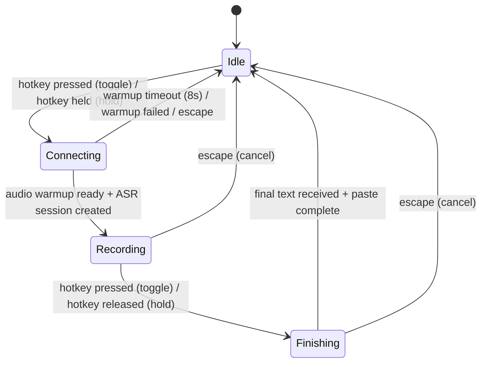
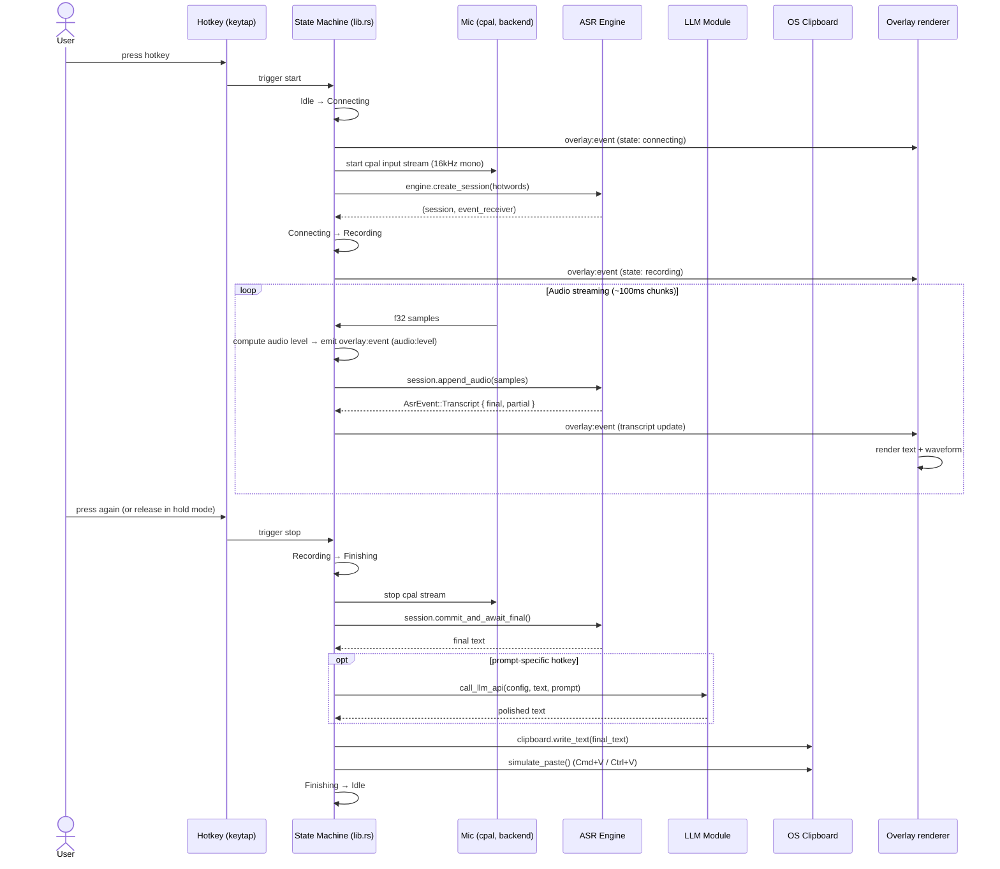

# Architecture & State Machine

## High-Level Architecture

```
┌─────────────────────────────────────────────────────────────────┐
│                        FRONTEND (WebView)                        │
│  ┌──────────────────────┐  ┌──────────────────────────────────┐ │
│  │   Overlay Window      │  │   Settings Window                │ │
│  │   React + AppKit      │  │   (React 19 + TypeScript)        │ │
│  │                       │  │                                  │ │
│  │  • Transcript display │  │  • Config pages (9 tabs)         │ │
│  │  • Waveform           │  │  • Model management              │ │
│  │  • Retry affordance   │  │  • Hotkey recording              │ │
│  └──────────┬───────────┘  └────────────┬─────────────────────┘ │
│             │          Tauri IPC          │                      │
│             │   invoke() + listen()       │                      │
└─────────────┼─────────────────────────────┼──────────────────────┘
              │                             │
┌─────────────┼─────────────────────────────┼──────────────────────┐
│             ▼          BACKEND (Rust)      ▼                      │
│  ┌──────────────────────────────────────────────────────────────┐│
│  │                    Tauri Command Handlers                     ││
│  │  send_audio_chunk │ get_config │ save_config │ download_model ││
│  │  + 24 more IPC commands                                       ││
│  └──────────────────────────┬───────────────────────────────────┘│
│                             │                                    │
│  ┌──────────────────────────▼───────────────────────────────────┐│
│  │                     State Machine                             ││
│  │  Idle ──▶ Connecting ──▶ Recording ──▶ Finishing ──▶ Idle   ││
│  │                    AppState enum + AppInner                   ││
│  └──────┬──────────────────────────────┬────────────────────────┘│
│         │                              │                         │
│  ┌──────▼──────┐              ┌────────▼────────┐                │
│  │  ASR Engine  │              │   LLM Module    │                │
│  │  (trait)     │              │   8 providers   │                │
│  │  ┌──────────┐│              │  OpenAI-compat  │                │
│  │  │ Doubao   ││              └─────────────────┘                │
│  │  │ WebSocket││                                                │
│  │  ├──────────┤│              ┌─────────────────┐                │
│  │  │ sherpa-  ││              │  Paste + Sound  │                │
│  │  │ onnx     ││              │  Clipboard      │                │
│  │  └──────────┘│              │  AppleScript/   │                │
│  └──────────────┘              │  PowerShell     │                │
│                                └─────────────────┘                │
│  ┌──────────────────────────────────────────────────────────────┐│
│  │  ConfigManager │ StatsService │ HotwordManager │ ModelRegistry││
│  │  HotkeyManager │ VoiceLogger  │ Updater                       ││
│  └──────────────────────────────────────────────────────────────┘│
└──────────────────────────────────────────────────────────────────┘
```

## State Machine

The recording lifecycle is a 4-state machine defined in `app_state.rs`.



**Toggle mode**: press once → start, press again → stop.  
**Hold mode**: hold the key → record, release → stop.  
**Escape**: cancels recording from Connecting, Recording, or Finishing state.

### State Gating

| State | Hotkey Behavior | Audio Input | Overlay Visible | Escape Active |
|-------|----------------|-------------|-----------------|---------------|
| Idle | Start recording | No | No | No |
| Connecting | Cancel | Warming up | Yes | Yes |
| Recording | Stop recording | Streaming | Yes | Yes |
| Finishing | Cancel | Stopped | Yes | Yes |

## Recording Data Flow



## Window Management

The app has three window-like surfaces:

### Overlay Window
- Transparent, always-on-top, ignores cursor events (clicks pass through)
- Visible on all workspaces (follows Spaces)
- Positioned at bottom-center of the primary monitor's work area (720×300, 48px above bottom)
- Repositioned on every show to follow display changes (external monitor plug/unplug)
- Created in code (`setup_overlay_window` in `lib.rs`; tauri.conf.json declares it with `create: false`). Audio is captured in the backend (cpal), so the overlay only renders
- **macOS**: a WebView-less native `Window` (`tauri::window::WindowBuilder`, requires the `unstable` feature) — the pill is painted natively by `overlay/macos.rs` as an `NSGlassEffectView` (Liquid Glass). No resident WKWebView, saving ~30–80MB
- **Windows**: a `WebviewWindow` hosting the React overlay (`web/src/overlay/index.tsx`); the native renderer in `overlay/macos.rs` is a no-op here

### Settings Window
- Standard window hosting the React settings app; shown on launch (update/stats indicator + launch affordance)
- On close (X button): destroyed to release its WebView memory (not hidden)
- Rebuilt on demand from the bundled window config when the tray "Settings" item is clicked (`WebviewWindowBuilder::from_config` in `show_settings`)
- Dock icon: shown when settings is open, hidden otherwise

### System Tray
- Two menu items: "Settings" (opens settings window) and "Quit" (exits app)
- Single-instance: `ExitRequested` with `code.is_none()` is prevented to keep app alive in tray

```
┌──────────────────────────────────────────────┐
│                   System Tray                 │
│  ┌─────────┐                                 │
│  │  Tray   │── Settings ──▶ show settings    │
│  │  Icon   │── Quit    ──▶ app.exit(0)       │
│  └─────────┘                                 │
└──────────────────────────────────────────────┘
                          │
                          ▼ (opens)
┌──────────────────────────────────────────────┐
│               Settings Window                 │
│  ┌──────────┐  ┌───────────────────────────┐ │
│  │  Sidebar  │  │  Page Content              │ │
│  │  Home     │  │  (9 pages)                 │ │
│  │  Audio    │  │                             │ │
│  │  Hotkey   │  │                             │ │
│  │  LLM      │  │                             │ │
│  │  ...      │  │                             │ │
│  └──────────┘  └───────────────────────────┘ │
└──────────────────────────────────────────────┘
         Dock icon: visible when settings shown

┌──────────────────────────────────────────────┐
│               Overlay Window                  │
│  (transparent, always-on-top, no cursor)      │
│  ┌────────────────────────────────────────┐  │
│  │  macOS: NSGlassEffectView native pill   │  │
│  │         (WebView-less native Window)    │  │
│  │  Windows: React overlay (WebviewWindow) │  │
│  │  ┌──────────────────────────────────┐  │  │
│  │  │  ●   Transcript text...           │  │  │
│  │  └──────────────────────────────────┘  │  │
│  └────────────────────────────────────────┘  │
└──────────────────────────────────────────────┘
```

## Key Design Decisions

| Decision | Rationale |
|----------|-----------|
| **keytap** over `tauri-plugin-global-shortcut` | Supports modifier-only hotkeys and left/right modifier distinction; lower latency via raw keyboard event stream |
| **Trait-based ASR** (`AsrEngine` / `AsrSession`) | Enables swapping between cloud (Doubao) and local (sherpa-onnx) engines without changing the recording loop |
| **Native overlay on macOS, React on Windows** | macOS renders the pill in a WebView-less native `Window` (`NSGlassEffectView` via `overlay/macos.rs`) for OS-grade Liquid Glass legibility and zero resident WKWebView; Windows renders the React overlay in a `WebviewWindow`. Audio is captured in the backend (cpal), so the macOS overlay needs no WebView at all |
| **Shared overlay layout** (`overlay/shared.rs`) | One `LayoutMetrics` struct drives both the macOS native pill and the Windows React pill (the latter fetches it via `get_overlay_layout_metrics`), keeping the two renderers pixel-aligned without duplicating constants |
| **serde_norway** for YAML | Preserves YAML structure and comments better than serde_yaml; important for user-editable config files |
| **gzip-compressed binary frames** for Doubao | Reduces WebSocket bandwidth for JSON-heavy protocol headers; matches ByteDance's proprietary wire format |
| **Feature-gated integration tests** | ASR and LLM integration tests require external resources (model files, API keys); gating them lets `cargo test` run fast in CI |
