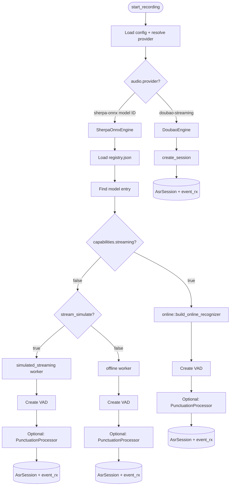
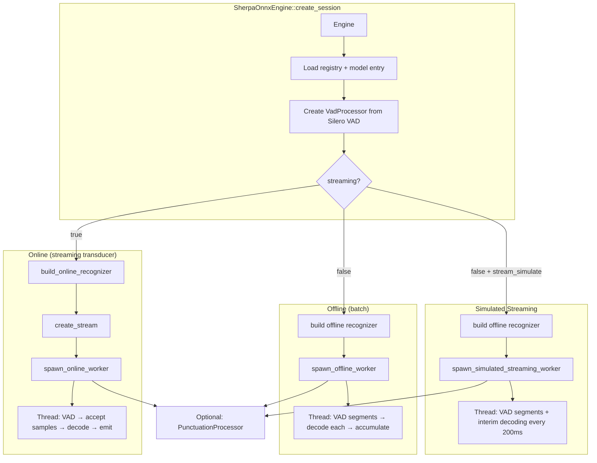

# ASR Engine System

## Trait System

All ASR backends implement two traits defined in `asr/mod.rs`. This allows the recording loop in `lib.rs` to work with any engine without knowing its internals.

```
┌─────────────────────────────────────┐
│            AsrEngine                │
│  (factory trait)                    │
│  create_session(&self, &[String])   │
│    → Result<(AsrSession, Receiver)  │
└──────────────┬──────────────────────┘
               │ produces
               ▼
┌─────────────────────────────────────┐
│            AsrSession               │
│  (session trait)                    │
│  is_ready() → bool                  │
│  append_audio(&self, &[f32])        │
│  commit_and_await_final() → String  │
│  close()                            │
└─────────────────────────────────────┘
               │ emits
               ▼
┌─────────────────────────────────────┐
│            AsrEvent                 │
│  (unified event enum)               │
│  Open                               │
│  Transcript { final, partial }      │
│  Error(String)                      │
│  Close { code, reason }             │
└─────────────────────────────────────┘
```

### AsrEngine

Factory that creates one session per recording. Receives hotwords as input.

### AsrSession

Represents a single recording session lifecycle:
- `append_audio` — receives 16kHz mono f32 PCM samples
- `commit_and_await_final` — signals end-of-audio, blocks until final result
- `close` — releases resources

### AsrEvent

Unified event type emitted by all engines. The `manage_asr_session` task in `recording/session.rs` converts these into `overlay:event` emissions for the frontend.

## Engine Dispatch Flow



## Doubao WebSocket ASR

ByteDance's proprietary streaming ASR over WebSocket with a custom binary framing protocol.

### Binary Protocol

```
┌──────────────────────────────────────────────────────┐
│                    Frame Structure                     │
├──────────┬──────────┬──────────┬──────────┬──────────┤
│ Byte 0   │ Byte 1   │ Byte 2   │ Byte 3   │ Bytes 4+ │
├──────────┼──────────┼──────────┼──────────┼──────────┤
│ Protocol │ Msg Type │ Serializ │ Reserved │ Payload  │
│ Version  │ + Flags  │ + Compr  │ (0x00)   │          │
│ (0x11)   │ (4:4)    │ (4:4)    │          │          │
└──────────┴──────────┴──────────┴──────────┴──────────┘

Message Types:
  0x01 — Full client request (JSON, gzip-compressed)
  0x02 — Audio-only request (raw PCM, no compression)
  0x09 — Server acknowledgement
  0x0F — Server error

Flags (for audio frames):
  0x00 — Normal audio
  0x02 — Last audio frame (end of stream)
```

### Connection Lifecycle

```
Client                                    Server
  │                                          │
  │── WS Connect (with auth headers) ──────▶│
  │   X-Api-App-Key, X-Api-Access-Key,       │
  │   X-Api-Resource-Id, X-Api-Connect-Id    │
  │                                          │
  │── Full Client Request (0x01) ──────────▶│
  │   { audio: {...}, request: {...},        │
  │     context_hotwords: [...] }            │
  │                                gzip      │
  │                                          │
  │◀── Server Ack (0x09) ──────────────────│
  │                                          │
  │── Audio Frame (0x02) ─────────────────▶│
  │── Audio Frame (0x02) ─────────────────▶│
  │── ...                                    │
  │                                          │
  │◀── Result Frame ───────────────────────│
  │   { utterances: [{ text, is_final }] }   │
  │                                gzip      │
  │                                          │
  │── Last Audio (0x02, flag=0x02) ───────▶│
  │                                          │
  │◀── Final Result ───────────────────────│
  │                                          │
  │── WS Close ────────────────────────────▶│
```

### Audio Encoding

Frontend sends Int16 PCM via base64 → Rust decodes → converts to f32 → `DoubaoSession.append_audio()` converts back to i16 → frames as binary WebSocket message.

## sherpa-onnx Architecture

Local ASR using sherpa-onnx library. Three execution modes:



### Supported Architectures

| Architecture | Model | Streaming | Hotwords | Punctuation | ITN |
|-------------|-------|-----------|----------|-------------|-----|
| `transducer` | Zipformer | Native | `hotwords_buf` (in-memory) | Built-in | Yes |
| `sense_voice` | SenseVoice | No | No | External | Yes |
| `funasr_nano` | FunASR-Nano | No | Comma-separated in config | External | Yes |
| `qwen3_asr` | Qwen3-ASR | No | Comma-separated in config | External | Yes |

### Online Mode (Zipformer)

Audio flows through VAD first. While VAD detects speech but hasn't produced a complete segment, raw audio is fed directly to the streaming recognizer for real-time partial results. When VAD produces a complete segment, it's processed in fixed chunk sizes (`streaming_chunk_size`, default 3200 samples).

Hotwords are validated against the model's tokens.txt (OOV filtering for cjkchar / bpe modeling units), then loaded into an in-memory `hotwords_buf`. After recognition, `restore_hotword_case` maps normalized output back to the user's original casing.

### Simulated Streaming Mode

For offline models when `stream_simulate: true`. The worker:
1. Runs VAD on incoming audio
2. Decodes completed VAD segments (same as offline)
3. Every ~200ms during active speech, decodes the entire buffer for interim results → emits as `partial_text`
4. When VAD confirms a segment, moves it to `final_text` and resets the interim buffer

### Offline Mode

Pure batch mode. VAD segments speech → each segment decoded independently → text accumulated. No partial results during speech.

## VAD (Voice Activity Detection)

All sherpa-onnx models use Silero VAD via `vad.rs`.

```
Audio Stream (16kHz f32)
        │
        ▼
┌───────────────────┐
│   VadProcessor     │
│   Window: 512      │
│   samples          │
└───────┬───────────┘
        │ detects speech segments
        ▼
┌───────────────────┐
│ Vec<Vec<f32>>     │
│ (speech segments) │
└───────────────────┘
```

Configurable parameters (merged from registry defaults + user config):
- `threshold` — speech probability threshold
- `min_silence_duration` — silence before segment boundary
- `min_speech_duration` — minimum speech to consider a segment
- `max_speech_duration` — maximum segment before forced split
- `num_threads` / `provider` — ONNX runtime config

## Punctuation Restoration

Uses a CT-Transformer model via sherpa-onnx. Applied after the ASR model produces final text.

**When it activates:**
- `punctuation_mode: "force"` → always use external punctuation
- `punctuation_mode: "auto"` → use only if ASR model lacks built-in punctuation
- `punctuation_mode: "disabled"` → never use

Punctuation is applied during `commit_and_await_final` — the final accumulated text is run through the punctuation model before being returned.

## Adding a New ASR Model

### For a new sherpa-onnx model architecture:

1. **Add registry entry** in `schemas/registry.json`:
   ```json
   {
     "id": "my-model",
     "type": "offline",
     "category": "asr",
     "engine": "sherpa-onnx",
     "name": "My Model",
     "description": "...",
     "capabilities": { "streaming": false, "hotwords": false, "punctuation": false, "itn": false },
     "languages": ["zh", "en"],
     "architecture": "my_arch",
     "download_url": "https://...",
     "file_size": 100,
     "mem_size": 200,
     "model_files": { "model": "model.onnx", "tokens": "tokens.txt" },
     "default_config": { "num_threads": 4 }
   }
   ```

2. **Create a builder module** in `asr/sherpa_onnx/my_model.rs`:
   ```rust
   pub fn build_my_model_recognizer(
       model_dir: &Path,
       entry: &ModelEntry,
       num_threads: u32,
       config: &serde_json::Value,
       hotwords: Option<&str>,
   ) -> Result<OfflineRecognizer, String> {
       // Build OfflineRecognizerConfig from model_files, config, hotwords
       // Call sherpa_onnx::offline_recognizer_new(config)
   }
   ```

3. **Add the architecture dispatch** in `asr/sherpa_onnx/mod.rs` in the `create_session` match arms.

4. **Provide model download** — upload the ONNX model files and update `download_url`.

### For a new cloud ASR provider:

1. Implement `AsrEngine` and `AsrSession` traits
2. Add provider detection in `lib.rs` `start_recording`
3. Add config fields to `AppConfig` in `config.rs`
4. Register in `registry.json` with `engine: "<your-engine>"`
