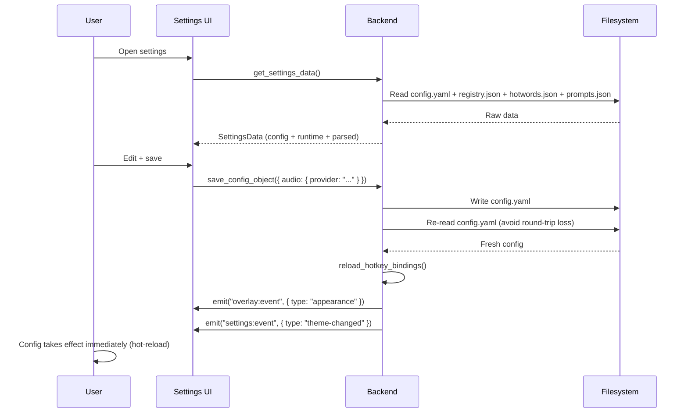

# Configuration System

## ConfigManager Design

```
┌─────────────────────────────────────────────┐
│               ConfigManager                  │
│  ┌───────────────────────────────────────┐  │
│  │  RwLock<AppConfig>  (memory cache)    │  │
│  └───────────────────────────────────────┘  │
│                                              │
│  load_config() → copy from disk if stale    │
│  save_config() → write YAML, then re-read   │
│  reset_to_defaults() → copy from example    │
│  get_editable_config() → fresh disk read    │
└──────────────────┬──────────────────────────┘
                   │ reads/writes
                   ▼
┌─────────────────────────────────────────────┐
│  {app_data_dir}/                             │
│  ├── config.yaml        (runtime config)     │
│  ├── prompts.json       (prompt templates)   │
│  ├── hotwords.json      (hotword library)    │
│  └── registry.json      (model registry)     │
└─────────────────────────────────────────────┘
                   │ bundled as resources
                   ▼
┌─────────────────────────────────────────────┐
│  {resource_dir}/                             │
│  ├── config.yaml.example  (default template) │
│  ├── prompts.json         (default prompts)  │
│  ├── hotwords.json        (default hotwords) │
│  └── registry.json        (model registry)   │
└─────────────────────────────────────────────┘
```

**Key behaviors:**
- On first run, copies example files from resource dir to app data dir
- `save_config()` writes then re-reads from disk — avoids YAML-to-JSON round-trip precision loss
- `get_editable_config()` bypasses the cache, reading fresh from disk for the settings UI
- Hot-reload: saving config emits `overlay:event` (appearance) + `settings:event` (theme-changed)

## config.yaml Structure

Three top-level sections:

### app — Application Settings

| Field | Type | Default | Description |
|-------|------|---------|-------------|
| `hotkey` | string/array | `"ControlLeft+Space"` | Global hotkey binding |
| `hotkey_mode` | string | `"toggle"` | `"toggle"` or `"hold"` |
| `remove_trailing_period` | bool | `true` | Strip trailing period from ASR output |
| `keep_clipboard` | bool | `true` | Keep text in clipboard after paste |
| `theme` | string | `"system"` | `"dark"` / `"light"` / `"system"` |
| `overlay_style` | string | `"liquid"` | macOS overlay appearance (3 variants) |
| `sound.enabled` | bool | `true` | Enable start/end sounds |
| `sound.start_sound` | string | `""` | Path to custom start sound |
| `sound.end_sound` | string | `""` | Path to custom end sound |
| `beta_updates` | bool | `false` | Enable beta update channel |

### audio — ASR Configuration

| Field | Type | Default | Description |
|-------|------|---------|-------------|
| `provider` | string | `"doubao-streaming"` | Active ASR model ID |
| `asr_defaults` | object | — | Shared defaults for all sherpa-onnx models |
| `asr_defaults.stream_simulate` | bool | `true` | Simulate streaming for offline models |
| `asr_defaults.hotword_llm_mode` | string | `"auto"` | Hotword injection into LLM prompt |
| `asr_defaults.punctuation_mode` | string | `"auto"` | External punctuation: auto/force/disabled |
| `asr_defaults.num_threads` | u32 | `2` | ONNX runtime threads |
| `asr_defaults.provider` | string | `"cpu"` | ONNX execution provider |
| `asr_defaults.vad` | object | — | Default VAD parameters |
| `doubao-streaming` | object | — | Doubao WebSocket credentials and params |
| `<model-id>` | object | — | Per-model overrides (e.g. `sherpa-onnx-streaming-zipformer-zh-en`) |

Per-model configs are keyed by model ID (matching `registry.json`). Each model can override `num_threads`, `provider`, and model-specific parameters like `chunk_size`, `hotwords_score`, `language`, etc.

### llm — LLM Configuration

| Field | Type | Default | Description |
|-------|------|---------|-------------|
| `provider` | string | `"deepseek"` | Active provider |
| `url` | string | `""` | Top-level fallback URL |
| `api_key` | string | `""` | Top-level fallback API key |
| `model` | string | `""` | Top-level fallback model |
| `<provider>` | object | — | Provider-specific overrides (deepseek, openai, anthropic, gemini, openrouter, siliconflow, ollama, openai_compatible) |

Configuration layering: provider-specific fields override top-level fields. See [llm-integration.md](llm-integration.md) for details.

## ModelRegistry (`registry.json`)

The model registry declares all available models (ASR, VAD, punctuation) with their capabilities, download URLs, and configuration schemas.

### ModelEntry Structure

```
ModelEntry
├── id: "model-unique-id"
├── type: "online" | "offline"
├── category: "asr" | "vad" | "punctuation"
├── engine: "volcengine" | "sherpa-onnx"
├── name: "Display Name"
├── description: "..."
├── tags: ["tag1", "tag2"]
├── capabilities:
│   ├── streaming: bool
│   ├── hotwords: bool
│   ├── punctuation: bool
│   └── itn: bool
├── languages: ["zh", "en"]
├── [online only] requires_config: ["url", "app_id", ...]
├── [offline only] architecture: "transducer" | "sense_voice" | ...
├── [offline only] download_url: "https://..."
├── [offline only] file_size: 100 (MB)
├── [offline only] mem_size: 200 (MB)
├── [offline only] model_files: { "model": "model.onnx", ... }
└── [offline only] default_config: { "num_threads": 4, ... }
```

### Model Resolution

When `audio.provider` is set to a model ID, the engine:
1. Loads `registry.json`
2. Finds the entry matching the ID
3. Reads `entry.engine` to choose Doubao vs. sherpa-onnx
4. For sherpa-onnx: reads `entry.architecture` and `entry.capabilities.streaming` to dispatch to the correct recognizer builder

### Model Download

Offline models are downloaded to `{app_data_dir}/models/<model-id>/`. The download flow:
1. Frontend calls `downloadModel(id)` → backend streams from `download_url`
2. Progress events emitted on `model:download:progress` channel
3. Downloaded archive (tar.bz2) is extracted to the model directory
4. `getDownloadedModels()` checks which registry entries have corresponding directories

## Hotwords (`hotwords.json`)

Grouped keyword library for improving ASR accuracy on domain-specific terms:

```json
{
  "groups": [
    {
      "id": "group-id",
      "name": "Group Name",
      "words": ["keyword1", "keyword2"],
      "enabled": true
    }
  ]
}
```

- Groups can be toggled on/off individually
- Active hotwords (from enabled groups) are passed to `AsrEngine::create_session()`
- The `HotwordManager` handles import from legacy Doubao config format

## Prompts (`prompts.json`)

LLM prompt templates for text polishing:

```json
[
  {
    "id": "prompt-id",
    "name": "Prompt Name",
    "prompt": "System prompt text...",
    "hotkey": "F14",
    "hotkey_mode": "hold"
  }
]
```

- Each prompt can have its own hotkey and mode
- Prompts with hotkeys trigger recording with LLM polishing
- Main hotkey (no prompt) bypasses LLM

## Configuration Flow


