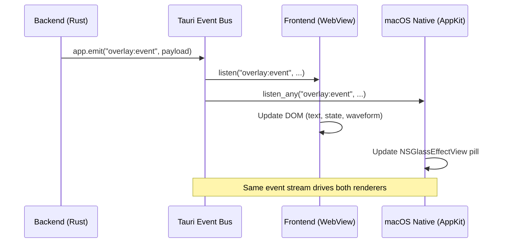
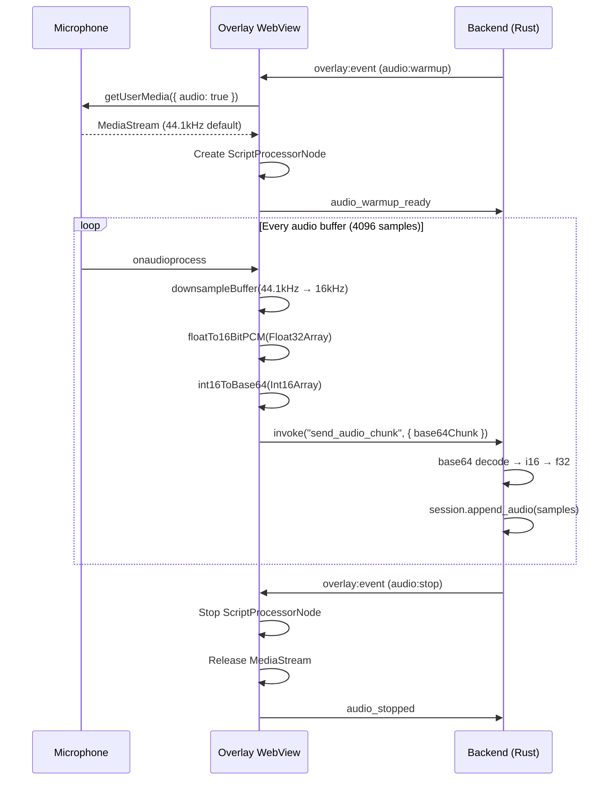

# Frontend & IPC

## Frontend Architecture

The frontend has two entry points, built by Vite as separate pages:

```
web/
├── index.html                    # Overlay window entry
│   └── src/ui/main-overlay.ts    #   Vanilla TypeScript (no framework)
├── settings.html                 # Settings window entry
│   └── src/ui/SettingsApp.tsx    #   React 19 + TypeScript
├── src/
│   ├── bridge/                   # Tauri IPC layer
│   │   ├── index.ts              #   Re-exports overlay + settings
│   │   ├── overlay.ts            #   Overlay IPC wrappers
│   │   └── settings.ts           #   Settings IPC wrappers
│   ├── lib/                      # Pure utilities (no DOM/side-effects)
│   │   ├── audio.ts              #   PCM helpers (downsample, float→int16, base64)
│   │   ├── format.ts             #   Text formatting
│   │   ├── hotkey.ts             #   Hotkey display/parse
│   │   ├── model.ts              #   Model registry helpers
│   │   └── sound.ts              #   Sound playback
│   ├── types/                    # TypeScript type definitions
│   │   ├── config.ts
│   │   ├── hotwords.ts
│   │   ├── models.ts
│   │   ├── stats.ts
│   │   └── update.ts
│   └── ui/
│       ├── SettingsApp.tsx       # Settings root: sidebar + page routing
│       ├── SettingsProvider.tsx  # Shared state context
│       ├── components/           # Reusable UI primitives
│       │   ├── Button.tsx
│       │   ├── Heatmap.tsx       #   Calendar heatmap (stats)
│       │   ├── Input.tsx
│       │   ├── KeyCap.tsx        #   Keyboard key display
│       │   ├── Modal.tsx
│       │   ├── SegmentedControl.tsx
│       │   ├── ThemeSelector.tsx
│       │   └── Toggle.tsx
│       ├── layout/
│       │   ├── PageLayout.tsx    #   Page wrapper
│       │   └── Sidebar.tsx       #   Navigation sidebar
│       └── pages/                # Settings pages (9 tabs)
│           ├── HomePage.tsx      #   Stats + heatmap
│           ├── AudioModelPage.tsx #  ASR provider + model management
│           ├── HotkeyPage.tsx    #   Hotkey configuration + recording
│           ├── LLMPage.tsx       #   LLM provider + prompt config
│           ├── AppSettingsPage.tsx #  Theme, overlay style, sounds
│           ├── HotwordsPage.tsx  #   Hotword library management
│           ├── PermissionsPage.tsx #  Mic + accessibility checks
│           ├── AboutPage.tsx     #   Version, links
│           └── FeedbackPage.tsx  #   User feedback
└── tests/                        # Frontend tests (Vitest + jsdom)
    ├── bridge/
    │   ├── overlay.test.ts
    │   └── settings.test.ts
    └── lib/
        ├── audio.test.ts
        ├── format.test.ts
        ├── hotkey.test.ts
        └── model.test.ts
```

### React Component Tree (Settings Window)

```
SettingsApp
└── SettingsProvider (context: all config + state)
    └── PageLayout
        ├── Sidebar (navigation tabs)
        └── Active Page
            ├── HomePage
            ├── AudioModelPage
            ├── HotkeyPage
            ├── LLMPage
            ├── AppSettingsPage
            ├── HotwordsPage
            ├── PermissionsPage
            ├── AboutPage
            └── FeedbackPage
```

### Overlay Window (Vanilla TS)

The overlay uses vanilla TypeScript to minimize overhead — it needs to capture audio and render text with low latency. No React, no framework. The entry point is `main-overlay.ts`:

```
main-overlay.ts
├── State management (appState, transcript)
├── Audio capture (getUserMedia → ScriptProcessorNode → downsample → base64 → IPC)
├── Event handling (overlay:event listener → update text/waveform/state)
└── DOM updates (text display, waveform, state-dependent visibility)
```

## IPC Bridge Design

Communication uses two complementary Tauri primitives:

### invoke (Request-Response)

Frontend calls typed async wrappers that map to `#[tauri::command]` functions in `commands.rs`:

```
Frontend                          Backend
───────                          ───────
bridge/overlay.ts                commands.rs
  sendAudioChunk() ────────────▶ send_audio_chunk()
  getConfig() ─────────────────▶ get_app_config()

bridge/settings.ts               commands.rs
  getData() ───────────────────▶ get_settings_data()
  saveConfigObject() ──────────▶ save_config_object()
  getStats() ──────────────────▶ get_stats()
  downloadModel() ─────────────▶ download_model()
  ...                             ...
```

28 commands are registered in `lib.rs` via `tauri::generate_handler![]`.

### listen / emit (Event-Driven)

The backend emits events; the frontend subscribes:

| Channel | Direction | Purpose |
|---------|-----------|---------|
| `overlay:event` | Backend → Frontend | State changes, transcript text, audio lifecycle, appearance |
| `settings:event` | Backend → Frontend | Theme changes after config save |
| `model:download:progress` | Backend → Frontend | ASR model download progress |
| `update:progress` | Backend → Frontend | App update download progress |

### Event Flow



## Audio Capture Pipeline

Audio capture happens entirely in the frontend WebView (required for `getUserMedia`):



### PCM Helper Functions (`web/src/lib/audio.ts`)

| Function | Input | Output | Purpose |
|----------|-------|--------|---------|
| `downsampleBuffer` | Float32Array, in rate, out rate | Float32Array | Decimate to 16kHz via averaging |
| `floatTo16BitPCM` | Float32Array (-1..1) | Int16Array | Quantize float to 16-bit integer |
| `int16ToBase64` | Int16Array | string (base64) | Encode for IPC transport |

## Overlay Window

### WebView Overlay (All Platforms)

- Transparent window (`transparent: true` in tauri.conf.json)
- Ignores cursor events — clicks pass through to windows below
- Visible on all workspaces — follows macOS Spaces
- Positioned at bottom-center of primary monitor (720×300, 48px above bottom)
- Repositioned on every show to handle display changes (external monitor)

### macOS Liquid Glass (Native Rendering)

On macOS, the overlay has **dual rendering**:

1. **WebView** — transparent, acts as audio worker (hidden from view)
2. **NSGlassEffectView** — native AppKit pill rendered by `overlay.rs`

The native pill mirrors the WebView's overlay events via `app.listen_any("overlay:event")`:

```
overlay:event ──▶ WebView (hidden, audio worker)
              ──▶ NSGlassEffectView (visible, native Liquid Glass)
                   ├── NSProgressIndicator (audio level bar)
                   └── NSTextField (transcript text, max 3 lines)
```

Layout: pill auto-sizes — single-line height for short text, up to 3 lines for longer content. Max width 520px.

## Paste Mechanism

Defined in `paste.rs`. The `simulate_paste()` function is platform-specific:

### macOS
```rust
// AppleScript: tell application "System Events" to keystroke "v" using command down
Command::new("osascript")
    .args(["-e", "tell application \"System Events\" to keystroke \"v\" using command down"])
```

### Windows
```rust
// PowerShell: Add-Type → [System.Windows.Forms.SendKeys]::SendWait("^v")
Command::new("powershell")
    .args(["-Command", "..."])
```

### Flow

1. `stop_recording` writes final text to clipboard via `tauri-plugin-clipboard-manager`
2. `simulate_paste()` triggers Cmd+V / Ctrl+V via OS automation
3. If paste fails (e.g. macOS accessibility permission denied), `PasteResult.permission_error` is set to `"accessibility"` so the frontend can guide the user

### Sound Playback

Sound files (start.mp3, end.mp3) are played asynchronously:
- macOS: `afplay <file>`
- Windows: `powershell -Command (New-Object Media.SoundPlayer <file>).Play()`

Sound plays at Recording start and optionally after paste completion.
