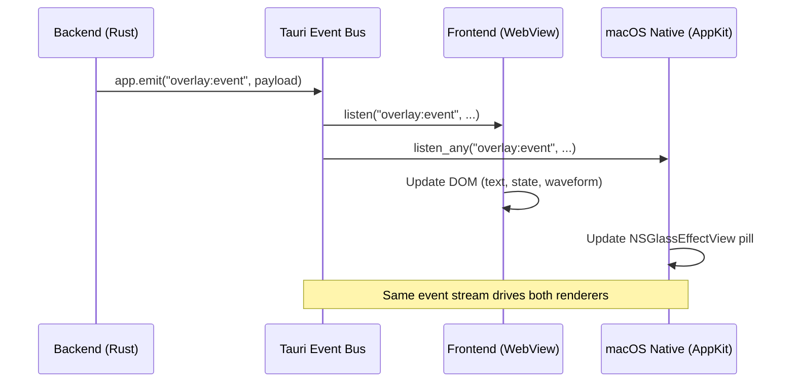
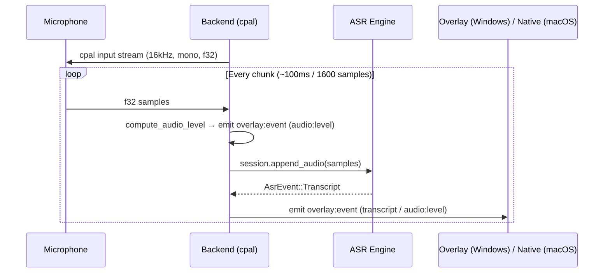

# Frontend & IPC

## Frontend Architecture

The frontend has two entry points, built by Vite as separate pages:

```
web/
├── index.html                    # Overlay window entry (Windows)
│   └── src/ui/Overlay.tsx        #   React 19 + TypeScript (macOS renders natively)
├── settings.html                 # Settings window entry
│   └── src/ui/SettingsApp.tsx    #   React 19 + TypeScript
├── src/
│   ├── bridge/                   # Tauri IPC layer
│   │   ├── index.ts              #   Re-exports overlay + settings
│   │   ├── overlay.ts            #   Overlay IPC wrappers
│   │   └── settings.ts           #   Settings IPC wrappers
│   ├── lib/                      # Pure utilities (no DOM/side-effects)
│   │   ├── format.ts             #   Text formatting
│   │   ├── hotkey.ts             #   Hotkey display/parse
│   │   ├── model.ts              #   Model registry helpers
│   │   └── sound.ts              #   Sound playback
│   ├── types/                    # TypeScript type definitions
│   │   ├── config.ts
│   │   ├── hotwords.ts
│   │   ├── models.ts
│   │   ├── stats.ts
│   │   └── update.ts
│   └── ui/
│       ├── Overlay.tsx            # Overlay root (Windows): React entry
│       ├── overlay/               # Overlay React app
│       │   ├── OverlayApp.tsx     #   stage + pill composition
│       │   ├── useOverlayState.ts #   overlay:event → state reducer
│       │   ├── useWaveform.ts     #   RAF waveform from audio:level
│       │   ├── useOverlayLayout.ts#   measureText pill sizing
│       │   ├── overlayText.ts     #   i18n hint/retry labels
│       │   └── components/        #   Indicator/Transcript/Waveform/Hint/RetryButton
│       ├── SettingsApp.tsx       # Settings root: sidebar + page routing
│       ├── SettingsProvider.tsx  # Shared state context
│       ├── components/           # Reusable UI primitives
│       │   ├── Button.tsx
│       │   ├── Heatmap.tsx       #   Calendar heatmap (stats)
│       │   ├── Input.tsx
│       │   ├── KeyCap.tsx        #   Keyboard key display
│       │   ├── Modal.tsx
│       │   ├── SegmentedControl.tsx
│       │   ├── ThemeSelector.tsx
│       │   └── Toggle.tsx
│       ├── layout/
│       │   ├── PageLayout.tsx    #   Page wrapper
│       │   └── Sidebar.tsx       #   Navigation sidebar
│       └── pages/                # Settings pages (9 tabs)
│           ├── HomePage.tsx      #   Stats + heatmap
│           ├── AudioModelPage.tsx #  ASR provider + model management
│           ├── HotkeyPage.tsx    #   Hotkey configuration + recording
│           ├── LLMPage.tsx       #   LLM provider + prompt config
│           ├── AppSettingsPage.tsx #  Theme, overlay style, sounds
│           ├── HotwordsPage.tsx  #   Hotword library management
│           ├── PermissionsPage.tsx #  Mic + accessibility checks
│           ├── AboutPage.tsx     #   Version, links
│           └── FeedbackPage.tsx  #   User feedback
└── tests/                        # Frontend tests (Vitest + jsdom)
    ├── bridge/
    │   ├── overlay.test.ts
    │   └── settings.test.ts
    └── lib/
        ├── format.test.ts
        ├── hotkey.test.ts
        └── model.test.ts
```

### React Component Tree (Settings Window)

```
SettingsApp
└── SettingsProvider (context: all config + state)
    └── PageLayout
        ├── Sidebar (navigation tabs)
        └── Active Page
            ├── HomePage
            ├── AudioModelPage
            ├── HotkeyPage
            ├── LLMPage
            ├── AppSettingsPage
            ├── HotwordsPage
            ├── PermissionsPage
            ├── AboutPage
            └── FeedbackPage
```

### Overlay Window (React, Windows only)

The overlay is a React app (`web/src/ui/Overlay.tsx` → `OverlayApp`), used only on Windows. On macOS the overlay is a WebView-less native Window whose pill is rendered by `overlay.rs` (see [Architecture](./architecture.md)). Audio is captured in the backend (cpal), so the renderer only paints text, the retry affordance, and a waveform driven by the backend `audio:level` event.

```
OverlayApp
├── useOverlayState   (overlay:event → state reducer; audio level via ref)
├── useOverlayLayout  (measureText → pill width + single/multi wrap)
├── useWaveform       (RAF: audio level → 4-bar scaleY)
└── stage
    └── pill
        ├── Indicator   (dot + spinner, state-driven via data-*)
        ├── body
        │   ├── Transcript (final + partial text)
        │   └── Hint        (status/error message)
        ├── Waveform     (4 bars)
        └── RetryButton  (failed-state retry, 5s auto-hide)
```

## IPC Bridge Design

Communication uses two complementary Tauri primitives:

### invoke (Request-Response)

Frontend calls typed async wrappers that map to `#[tauri::command]` functions in `commands.rs`:

```
Frontend                          Backend
───────                          ───────
bridge/overlay.ts                  commands.rs
  getConfig() ───────────────────▶ get_app_config()
  retryLatestFailedTranscription() ─▶ retry_latest_failed_transcription()

bridge/settings.ts               commands.rs
  getData() ───────────────────▶ get_settings_data()
  saveConfigObject() ──────────▶ save_config_object()
  getStats() ──────────────────▶ get_stats()
  downloadModel() ─────────────▶ download_model()
  ...                             ...
```

28 commands are registered in `lib.rs` via `tauri::generate_handler![]`.

### listen / emit (Event-Driven)

The backend emits events; the frontend subscribes:

| Channel | Direction | Purpose |
|---------|-----------|---------|
| `overlay:event` | Backend → Frontend | State changes, transcript text, audio lifecycle, appearance |
| `settings:event` | Backend → Frontend | Theme changes after config save |
| `model:download:progress` | Backend → Frontend | ASR model download progress |
| `update:progress` | Backend → Frontend | App update download progress |

### Event Flow



## Audio Capture Pipeline

Audio is captured in the **backend** via cpal (CoreAudio on macOS, WASAPI on Windows), not in the WebView. This keeps mic capture off the renderer thread and lets the macOS overlay drop its WebView entirely.



The frontend no longer ships PCM helpers — `web/src/lib/audio.ts` was removed when capture moved to the backend.

## Overlay Window

### Window properties (both platforms)

- Transparent window (created in code; tauri.conf.json `create: false`)
- Ignores cursor events — clicks pass through (re-enabled only for the retry button)
- Visible on all workspaces — follows macOS Spaces
- Positioned at bottom-center of primary monitor (720×300, 48px above bottom)
- Repositioned on every show to handle display changes (external monitor)

### macOS — native Liquid Glass (no WebView)

The overlay is a WebView-less native `Window`. `overlay.rs` paints an AppKit pill inside an `NSGlassEffectView`, driven by the same `overlay:event` stream tapped via `app.listen_any`:

```
overlay:event ──▶ NSGlassEffectView (visible, native Liquid Glass)
                   ├── indicator (dot / spinner)
                   ├── NSTextField (transcript, max 3 lines)
                   └── waveform bars + retry button
```

The `NSWindow` is reached via `raw-window-handle` (`AppKit.ns_view` → `[ns_view window]`), since `WebviewWindow::ns_window` no longer applies to this WebView-less window.

### Windows — React overlay

The overlay is a `WebviewWindow` running the React app above. `overlay:event`s drive React state → the pill's `data-*` attributes (state/mode/level/retry), with CSS doing the visual switching. Layout: pill auto-sizes — single-line for short text, up to 3 lines for longer content. Max width 520px.

## Paste Mechanism

Defined in `paste.rs`. The `simulate_paste()` function is platform-specific:

### macOS
```rust
// AppleScript: tell application "System Events" to keystroke "v" using command down
Command::new("osascript")
    .args(["-e", "tell application \"System Events\" to keystroke \"v\" using command down"])
```

### Windows
```rust
// PowerShell: Add-Type → [System.Windows.Forms.SendKeys]::SendWait("^v")
Command::new("powershell")
    .args(["-Command", "..."])
```

### Flow

1. `stop_recording` writes final text to clipboard via `tauri-plugin-clipboard-manager`
2. `simulate_paste()` triggers Cmd+V / Ctrl+V via OS automation
3. If paste fails (e.g. macOS accessibility permission denied), `PasteResult.permission_error` is set to `"accessibility"` so the frontend can guide the user

### Sound Playback

Sound files (start.mp3, end.mp3) are played asynchronously:
- macOS: `afplay <file>`
- Windows: `powershell -Command (New-Object Media.SoundPlayer <file>).Play()`

Sound plays at Recording start and optionally after paste completion.
