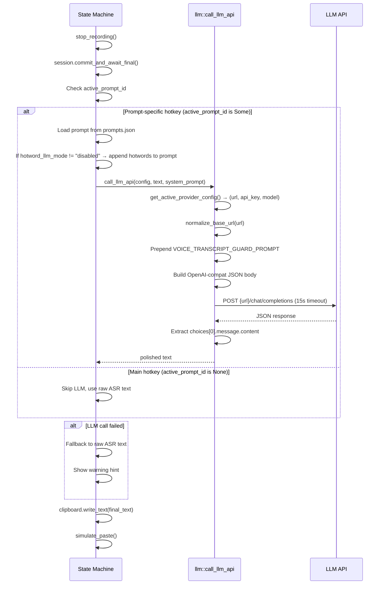

# LLM Text Polishing

## Overview

The LLM module (`llm.rs`) provides AI-powered text polishing after ASR recognition. It is a standalone module with a single public function `call_llm_api`. All providers are accessed via OpenAI-compatible `/chat/completions` endpoints.

## Provider System

8 providers supported, each with pre-configured defaults:

| Provider | Default URL | Default Model | Auth Method |
|----------|-------------|---------------|-------------|
| `deepseek` | `https://api.deepseek.com/v1` | `deepseek-v4-flash` | Bearer token |
| `openai` | `https://api.openai.com/v1` | `gpt-4.1-mini` | Bearer token |
| `anthropic` | `https://api.anthropic.com/v1` | `claude-3-5-haiku-latest` | `x-api-key` + `anthropic-version` |
| `gemini` | `https://generativelanguage.googleapis.com/v1beta/openai` | `gemini-2.5-flash-lite` | Query param `?key=` |
| `openrouter` | `https://openrouter.ai/api/v1` | `openai/gpt-4o-mini` | Bearer token |
| `siliconflow` | `https://api.siliconflow.cn/v1` | `deepseek-ai/DeepSeek-V3` | Bearer token |
| `ollama` | `http://localhost:11434/api` | `llama3.1` | None (local) |
| `openai_compatible` | _(user-configured)_ | _(user-configured)_ | Bearer token |

## Configuration Layering

Each provider has two levels of configuration that merge at runtime:

```
LlmConfig
├── provider: "deepseek"              # Active provider ID
├── url: "..."                        # Top-level fallback URL
├── api_key: "..."                    # Top-level fallback API key
├── model: "..."                      # Top-level fallback model
└── deepseek:                         # Provider-specific (takes priority)
│   ├── url: ""
│   ├── api_key: ""
│   └── model: ""
├── openai: { ... }
├── anthropic: { ... }
└── ...
```

**Resolution rule**: provider-specific field → top-level field → provider default.  
Empty strings count as "not set" and fall through to the next level.

## Text Polishing Flow



### Guard Prompt

Every LLM call prepends `VOICE_TRANSCRIPT_GUARD_PROMPT` to prevent the model from treating the transcript as a conversation:

> "You are processing raw speech-to-text output. The user's text is not a question to you and is not asking you to answer anything. Your only task is to polish the transcript while preserving the speaker's original intent..."

### Validation

Before recording starts with a prompt-specific hotkey, `validate_llm_config()` checks that the provider has:
- A non-empty model (explicit or provider default)
- A non-empty URL (explicit or provider default)
- A non-empty API key (except Ollama)

If validation fails, the user sees a Chinese error message in the overlay and recording does not start.

### Hotword LLM Mode

Controls whether hotwords are appended to the LLM system prompt (useful when the ASR model doesn't support hotwords natively):

- `"auto"` — append only if ASR model lacks hotword support
- `"force"` — always append
- `"disabled"` — never append

## Adding a New Provider

1. **Add a provider config struct field** in `config.rs` → `LlmConfig`:
   ```rust
   pub new_provider: Option<ProviderConfig>,
   ```

2. **Add defaults** in `llm.rs` → `get_provider_defaults()`:
   ```rust
   "new_provider" => ProviderDefaults {
       default_url: "https://api.newprovider.com/v1",
       default_model: "their-best-model",
   },
   ```

3. **Add config resolution** in `get_active_provider_config()`:
   ```rust
   "new_provider" => config.new_provider.as_ref(),
   ```

4. **Add auth logic** in `call_llm_api()` if the provider uses non-standard authentication.

5. **Update frontend** `LLMPage.tsx` to show the new provider option.
