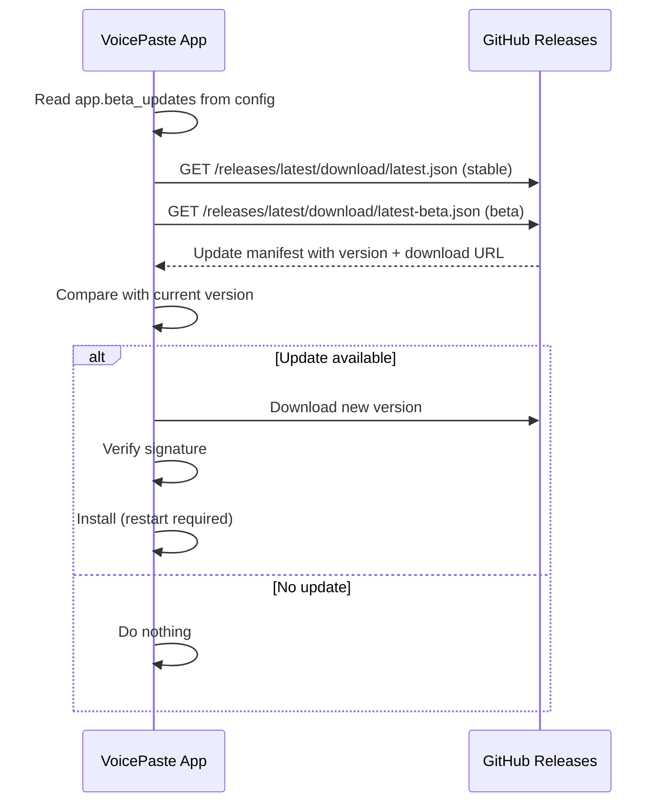

# Testing & Release

## Test Strategy

Three-layer testing pyramid:

| Layer | Location | Trigger | Scope |
|-------|----------|---------|-------|
| **Rust unit tests** | Inline `#[cfg(test)] mod tests` in each `.rs` file | `cargo test` | Pure logic — parsing, validation, serialization. Uses `tempfile` for I/O. No network. Runs in CI. |
| **Rust integration tests** | `src-tauri/src/tests/` (Cargo feature-gated) | `pnpm test:asr` / `pnpm test:llm` | Requires sherpa-onnx models or LLM API keys. NOT run in CI. |
| **Frontend tests** | `web/tests/` (Vitest + jsdom) | `npx vitest run` | Component logic, pure functions. Mocks `window.__TAURI__` and Web APIs. |

### Test Requirements by Phase

| Phase | Requirement |
|-------|-------------|
| Core feature development | Unit tests for all pure logic functions |
| Cross-module features | Integration tests as needed |
| Before code review | All unit tests pass (`cargo test`, `npx vitest run`) |
| Before release | All unit + integration tests pass (`pnpm test`, `pnpm test:asr`, `pnpm test:llm`) |

## Rust Test Conventions

### Unit Tests

Follow the Rust standard: unit tests live **inline** at the bottom of each source file.

```rust
#[cfg(test)]
mod tests {
    use super::*;

    #[test]
    fn test_specific_behavior() {
        let result = function_under_test(input);
        assert_eq!(result, expected);
    }
}
```

**Conventions:**
- Pure logic functions (parsers, validators, serializers) **must** have unit tests
- File I/O tests use `tempfile::tempdir()` for isolation (auto-cleanup)
- HTTP tests use `wiremock` to start a mock server
- Complex types should include round-trip serialization checks
- No `#[allow(dead_code)]` or `#[allow(unused_imports)]` in production code — delete dead code instead

### Integration Tests

Located in `src-tauri/src/tests/` with opt-in Cargo features:

```toml
[features]
default = []
asr-integration = []   # enables ASR integration tests
llm-integration = []   # enables LLM integration tests
```

- Access internal APIs via `use crate::...` (part of the library crate)
- Test audio fixtures live in `src-tauri/src/tests/fixtures/`
- ASR models are read from the app data directory — tests never download models
- LLM tests read API keys from environment variables

## Frontend Test Conventions

Tests live under `web/tests/`, organized by module:

```
web/tests/
├── bridge/
│   ├── overlay.test.ts
│   └── settings.test.ts
└── lib/
    ├── format.test.ts
    ├── hotkey.test.ts
    ├── hotwords.test.ts
    └── model.test.ts
```

**Conventions:**
- Vitest + jsdom for DOM environment
- Mock `window.__TAURI__` via test helpers
- Prioritize testing pure logic functions over side-effect-heavy code
- Mock helpers live alongside test files

```bash
pnpm test             # Run all tests (vitest + cargo test)
pnpm test:watch       # Frontend tests in watch mode
pnpm test:asr         # ASR integration tests
pnpm test:llm         # LLM integration tests
```

## Build Pipeline

### Development Build

```bash
pnpm dev              # Full Tauri app with hot-reload
pnpm dev:web          # Vite dev server only (frontend hot-reload on port 1420)
pnpm build:web        # Production frontend build (Vite → web/dist)
```

### Production Build

```bash
pnpm pack                           # All platforms, unsigned
pnpm pack -s                        # All platforms, signed + notarized (macOS)
pnpm pack -p apple_aarch64          # Single platform
pnpm pack -s -p apple_aarch64,win_x64  # Signed, specific platforms
pnpm pack -b                        # Beta channel (adds -beta to version)
```

**Platform keys:** `apple_aarch64`, `apple_x64`, `win_x64`

### Version Management

**Single source of truth: `package.json` → `"version"`**

The pack script auto-syncs the version to `Cargo.toml` before building. `tauri.conf.json` omits `version` — Tauri reads it from `Cargo.toml` at build time.

### Pack Script Flow

```
pnpm pack
  ├── Read version from package.json
  ├── Sync version to Cargo.toml
  ├── Run prepare-assets.ts (icons, tray icons)
  ├── Run validate-json.ts (schema validation)
  ├── For each platform:
  │   ├── cargo tauri build --target <target> --bundles <bundles>
  │   └── Collect artifacts to dist/
  └── Generate latest.json / latest-beta.json
```

### Code Signing & Notarization (macOS)

Production builds with `-s` require Apple credentials in `.env`:

```
APPLE_TEAM_ID=...
APPLE_SIGNING_IDENTITY="Developer ID Application: ..."
APPLE_ID=...
APPLE_PASSWORD=...
APPLE_TEAM_NAME=...
TAURI_SIGNING_PRIVATE_KEY=...
TAURI_SIGNING_PRIVATE_KEY_PASSWORD=...
```

The pack script sets environment variables for Tauri's bundler: `APPLE_SIGNING_IDENTITY`, `APPLE_CERTIFICATE`, `APPLE_CERTIFICATE_PASSWORD`, `APPLE_ID`, `APPLE_PASSWORD`, `APPLE_TEAM_ID`, `TAURI_PRIVATE_KEY`, `TAURI_KEY_PASSWORD`.

## Update System

VoicePaste uses `tauri-plugin-updater` with GitHub Releases as the update endpoint.

### Update Channels

Two channels: stable and beta, controlled by `app.beta_updates` in `config.yaml`.

```
Stable Release (latest non-prerelease)
├── latest.json          → points to stable assets
├── latest-beta.json     → points to beta assets (in prerelease)
├── VoicePaste_1.0.0_aarch64.dmg
└── VoicePaste_1.0.0_aarch64.dmg.sig

Beta Release (--prerelease)
├── VoicePaste_1.1.0-beta_aarch64.app.tar.gz
└── VoicePaste_1.1.0-beta_aarch64.app.tar.gz.sig
```

**Why this architecture:**
- GitHub's `/releases/latest/` only resolves to the latest **non-prerelease** release
- There is no static URL for prerelease releases
- `latest-beta.json` is uploaded to the **stable** release so it always resolves
- Its platform entries point to download assets in the prerelease release
- `--prerelease` flag ensures the Electron version on `main` branch ignores beta updates
- SemVer guarantees `1.1.0-beta < 1.1.0` — stable users never see beta updates

### Update Flow



### Release Workflow

Refer to the project skill at `.claude/skills/github-release/SKILL.md` for the full workflow.

**Stable release:**
```bash
gh release create v1.3.0 --latest --title "v1.3.0"
gh release upload v1.3.0 dist/*.dmg dist/*.sig dist/latest.json
```

**Beta release:**
```bash
# 1. Create prerelease with beta artifacts
gh release create v1.3.1-beta --prerelease --title "v1.3.1-beta"
gh release upload v1.3.1-beta dist/*.app.tar.gz dist/*.sig

# 2. Upload latest-beta.json to the CURRENT stable release
#    (so the URL /releases/latest/download/latest-beta.json resolves)
gh release upload v1.3.0 dist/latest-beta.json --clobber
```

**Beta → Stable promotion:**
Create a new stable release (e.g., `v1.3.1`). It becomes `/releases/latest/`. The old beta metadata is no longer reachable since no `latest-beta.json` points to it.
